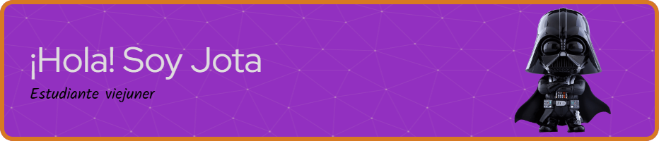

## Un placer tenerte por aquí! 😏 
  

  
  

## Sobre mí  
Estudiante de Administración de sistemas informáticos en red. Técnico en Sistemas Microinformáticos y Redes. Diseño y publicación de páginas web.  
  

 
<table><tr><td valign="top" width="50%">

#### 📍 Ubicación:####  Cartagena - Murcia 
 
  

#### 🎓 Formación:####  Técnico en Sistemas Microinformáticos y Redes. Diseño y publicación de páginas web.  

  

#### 📚 Actualidad:####  Estudiante de Administración de sistemas informáticos y redes.  

</td><td valign="top" width="50%">

  

</td></tr></table>  

   

## Lenguajes y herramientas  

  
  
  
  
  
  
  
  
  
  
  
  

  

   

## Estadísticas de Github  
<table><tr><td valign="top" width="50%">

</td><td valign="top" width="50%">

</td></tr></table>  

   

  

   

  
  

   

 

<!--
**Jotamuto/Jotamuto** is a ✨ _special_ ✨ repository because its `README.md` (this file) appears on your GitHub profile.

Here are some ideas to get you started:

- 🔭 I’m currently working on ...
- 🌱 I’m currently learning ...
- 👯 I’m looking to collaborate on ...
- 🤔 I’m looking for help with ...
- 💬 Ask me about ...
- 📫 How to reach me: ...
- 😄 Pronouns: ...
- ⚡ Fun fact: ...
-->
